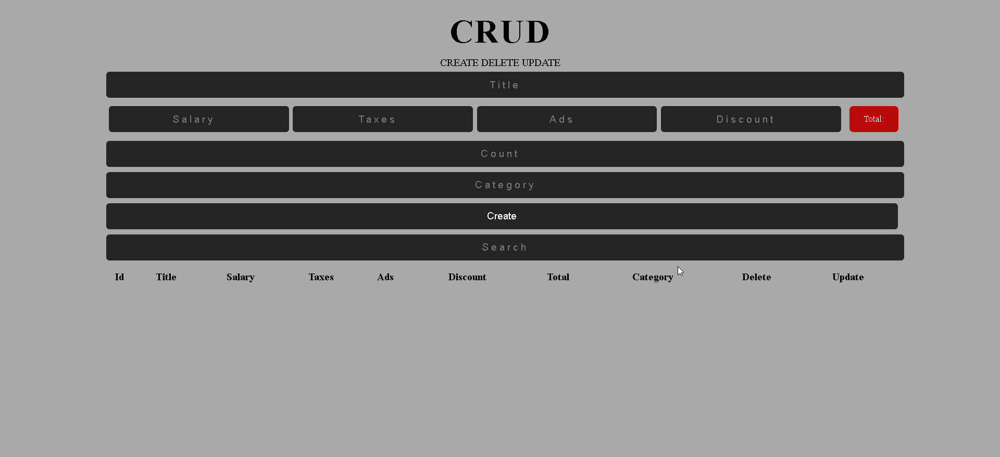

# CRUD App with HTML, CSS & JavaScript

A simple and clean CRUD (Create, Read, Update, Delete) web application built using pure **HTML**, **CSS**, and **JavaScript** — no frameworks or libraries.

---

## 📸 Preview

[CRUD App Live](https://omar-21-wael.github.io/CRUD-App/)

---

## 💡 Features

- Add new product entries with automatic total price calculation  
- Live calculation for salary, taxes, ads, and discount  
- Dynamic product table view  
- Update and delete individual products  
- "Delete All" feature for quick cleanup  
- Search functionality by title or category  
- Support for adding multiple products using the count input  
- Data is saved locally using `localStorage`

---
## 👨‍💻 Developer

**Omar Wael**  
💼 Full Stack Developer

- 📧 Email: [omar21wael@gmail.com](mailto:omar21wael@gmail.com)  
- 🐙 GitHub: [Omar-21-Wael](https://github.com/Omar-21-Wael)  
- 💼 LinkedIn: [linkedin.com/in/omar-wael](https://www.linkedin.com/in/omar-wael-46712a369/)  
- 🌐 Portfolio: _Coming Soon_

---

## 📄 License

This project is open for educational and personal portfolio use. Commercial use requires permission.
